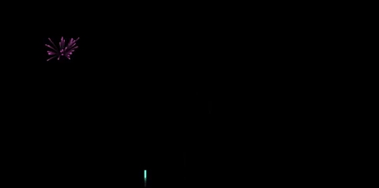
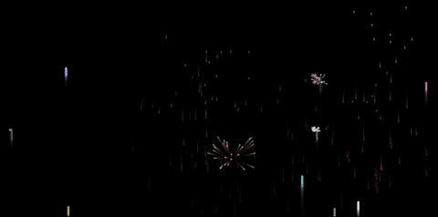

# Firework
> Processing based app to simulate a firework show.

The project main purpose is to simulate the physics of a projectiles to simulate a firework show. 

You can manipulate how many projectiles are in scene for a more vivid show.

## Tools

Processing, you can download the editor at the [website][processing]

## Project Information

**Project Members**
  * Nuno Cunha
  * Francisco Silva
  * Paulo Flores.

[IPMAIA][ipmaia] - Instituto Politécnico da Maia, Course - Desenvolvimento de Jogos Digitais. © 2018.

<!-- Markdown link & img dfn's -->
[processing]: https://processing.org/
[ipmaia]: https://www.ipmaia.pt/
